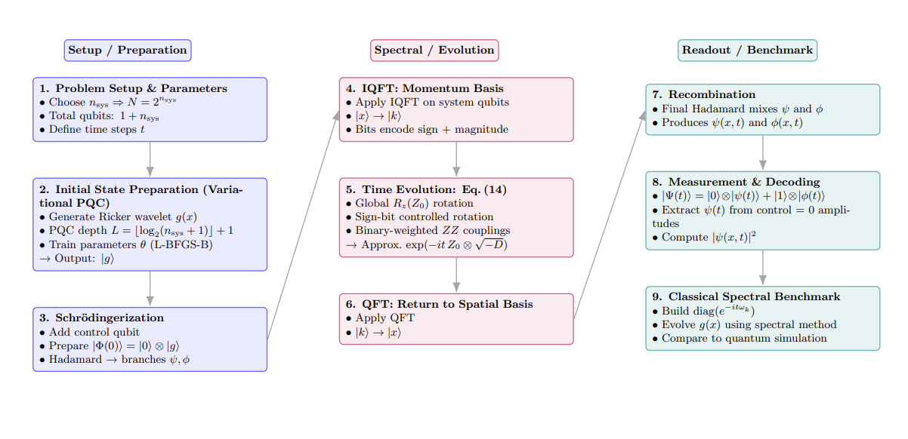
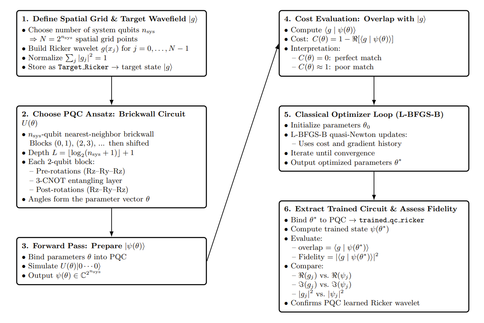

# Quantum Simulation of the 1D Wave Equation (NISQ-Oriented)

This repository contains a complete and reproducible workflow for simulating the **1D acoustic wave equation** using **gate-based quantum hardware and quantum simulators**. The work was developed as part of an **ErSE-299 directed research project at KAUST**, with a focus on evaluating the capability of **noisy intermediate-scale quantum (NISQ)** devices to model time-dependent wave propagation.

The methodology builds on:

- **Childs et al., Phys. Rev. A (2019)** — Schrödingerization-based quantum algorithm for wave equations  
- **Wright et al. (2024)** — NISQ-oriented simulation of the 1D wave equation  
- Quantum-geophysical formulations related to wave propagation and Helmholtz operators

This work studies how accurately the quantum algorithm reproduces the physical wavefield and provides a foundation for integrating quantum time evolution into geophysical forward-modeling workflows.

---

## Full Pipeline Overview

The complete simulation workflow is shown below, covering setup, variational state preparation, spectral evolution, and classical/quantum benchmarking:



## Variational Quantum State Preparation (VQSP)

The figure below summarizes the Variational Quantum State Preparation (VQSP) workflow used to train a parameterized quantum circuit to match a target wavefield. It shows how the PQC, cost function, and classical optimizer interact to learn the optimal parameters $\theta$ that encode the desired state.




---

## Install Qiskit (Specific Version)

This project uses **Qiskit** for its quantum computing components. To ensure consistency and reproducibility across environments, install the exact version used in development:

```bash
pip install qiskit==2.2.1
```

[//]: # (## Environment Setup &#40;Quick Start&#41;)

[//]: # ()
[//]: # (This project uses a dedicated conda environment named **Q1Dwave** to ensure full reproducibility of the simulations.)

[//]: # ()
[//]: # (### 1. Create and activate the environment)

[//]: # ()
[//]: # (From the root of the repository &#40;where `environment.yml` is located&#41;, run:)

[//]: # ()
[//]: # (```bash)

[//]: # (conda env create -f env.yml)

[//]: # (conda activate Q1Dwave)

[//]: # (```)

[//]: # ()
[//]: # (### 2. Register the environment as a Jupyter kernel)

[//]: # (```bash)

[//]: # (python -m ipykernel install --user --name Q1Dwave --display-name "Python &#40;Q1Dwave&#41;")
[//]: # (```)

---

## Repository Layout

```text
notebooks/
    Experiments/                              # Experiments and simulations
        NoiseExperiments.ipynb                # Noise models and robustness studies
        PQCExperiments.ipynb                  # PQC architecture and training tests
    Quantum1DWaveFullSimulation.ipynb         # Full 1D wave-equation simulation pipeline
    VariationalQuantumStatePreparation.ipynb  # VQSP and Ricker-state preparation

docs/                               # Figures used in README and documentation

environment.yml                     # Conda environment for reproducing results
README.md                           # Project overview and documentation
```

---

## Acknowledgments

Portions of the language editing, technical phrasing, and code refinement in this repository were assisted by ChatGPT. All modeling decisions, implementations, and interpretations were generated by the author.

